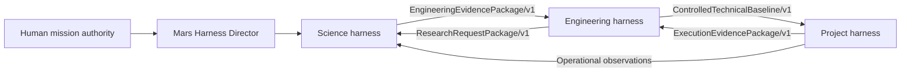

# Mars Harness Lab

**From AI-assisted work to connected, evidence-carrying R&D.**

Mars Harness Lab is an open set of methods, agent instructions, reusable skills, templates, and technical examples for coordinating scientific research, engineering, and project delivery. It explores how specialized AI harnesses can carry approved work products across domain boundaries while people retain mission authority and responsibility.

> A harness is the control system around an AI model: role instructions, state, approved context, tools, work-product contracts, checks, memory, and human decision rights.

**Live lab:** [mars-harness-lab-v5.tallman-equi-9130.chatgpt.site](https://mars-harness-lab-v5.tallman-equi-9130.chatgpt.site/) · **License:** Apache-2.0 for original lab materials, except where noted.

## Contents

- [Why the lab exists](#why-the-lab-exists)
- [What makes the Harness Lab different](#what-makes-the-harness-lab-different)
- [From model to mission system](#from-model-to-mission-system)
- [The three-domain chain](#the-three-domain-chain)
- [Science, engineering, and project workflows](#science-engineering-and-project-workflows)
- [Specialists, agents, and skills](#specialists-agents-and-skills)
- [Operational methods included](#operational-methods-included)
- [Human authority, ethics, and evidence](#human-authority-ethics-and-evidence)
- [MOXIE scale-up case study](#moxie-scale-up-case-study)
- [What is included and how to use it](#what-is-included-and-how-to-use-it)
- [Readiness and limitations](#readiness-and-limitations)
- [Open source and paid application access](#open-source-and-paid-application-access)
- [Repository map](#repository-map)

## Why the lab exists

R&D work spends substantial effort on source gathering, evidence synthesis, decision capture, document revision, design coordination, verification records, and project control. AI agents can assist with repeatable, bounded portions of that work. Researchers, engineers, and project leaders still set objectives, assess evidence, approve consequential transitions, and remain accountable for outcomes.

The lab studies three connected work areas:

| Domain | Work supported |
| --- | --- |
| Science and research | Frame a question; discover and assess evidence; maintain competing hypotheses; plan experiments or simulations; analyze results; document uncertainty; invite independent critique. |
| Engineering and design | Translate evidence into requirements; compare concepts; coordinate disciplines and interfaces; develop drawings, models, schematics, and parts data; verify against stated needs. |
| Project delivery | Convert objectives and approved baselines into owned work; manage schedule, resources, risks, dependencies, actuals, changes, acceptance, and closure. |

The ambition is to reduce avoidable coordination and documentation effort and shorten learning cycles. Savings are project-dependent and must be measured. This is augmentation, not a claim that AI replaces expert judgment, physical testing, qualification, certification, or accountable human work.

## What makes the Harness Lab different

The central idea is continuity: a science result should not become an untraceable engineering assumption, and an engineering baseline should not turn into unauthorized project work. Evidence, configuration, assumptions, decisions, and open questions travel with each approved handoff.

| Distinguishing capability | How the lab applies it |
| --- | --- |
| Specialized harnesses with explicit handoffs | Science, engineering, and project management use their own procedures and typed work products. A receiving domain sees an approved packet, not an invisible conversation history. |
| Deliberate alternatives | Bounded Tree of Thoughts (ToT), competing hypotheses, and trade studies compare options under explicit limits. Independent critics test assumptions; unresolved dissent remains visible. |
| Wiki and graph memory | Sources, claims, requirements, designs, tests, decisions, and tasks are linked by stable identifiers. Graph procedures support focused retrieval and downstream change-impact review. |
| Paired engineering artifacts | Schematics, pinouts, parts lists, and PCB outputs are reconciled together. Mechanical drawings, 3D models, assembly lists, and instructions are cross-checked as one controlled package. |
| Testable investigation | Experiment and simulation plans identify inputs, assumptions, limits, acceptance criteria, and review. Modeled output is labeled separately from measured evidence. |
| Repeatable document assembly | Start with an approved table of contents and section contracts; draft chapters against approved memory; reconcile shared facts and preserve revisions. |
| Bounded specialist collaboration | Specialists may work in parallel under a named lead, defined inputs and outputs, narrow permissions, review, and stop conditions. |
| Reproducibility and improvement | Run manifests, hashes, change records, replay checks, regression, and measures of cycle time, human effort, review, rework, cost, and quality support learning. |

The V5.2 operational methods package contains ten detailed methods, ten bounded specialist-role contracts, ten JSON templates, dependency-free local checking utilities, synthetic tests, and a capability/readiness map. The procedures and helpers are real downloadable materials; they are not claims that unconnected CAD, EDA, solver, telemetry, identity, or SaaS integrations have been deployed.

## From model to mission system

A large language model predicts likely continuations from its learned parameters and selected context. It can help synthesize, plan, write, code, and reason, but it is not by itself an authoritative database, persistent project system, laboratory, permission system, or approval body.

The harness provides controls around the model:

1. Identity, role, and ethical charter.
2. Phase state and allowed transitions.
3. Approved context retrieval and memory.
4. Least-privilege tools and explicit authority.
5. Typed input and output contracts.
6. Evidence locators, calculations, and acceptance checks.
7. Independent critique and ground-truth gates.
8. Versioned records, budgets, and reproducibility.
9. Human approval, escalation, and stop logic.

The working loop is:

`frame → retrieve → propose → act → observe → validate → critique → repair → approve → persist`

A generated statement is not an observation. A tool response is not automatically trustworthy. Passing a schema check is not scientific or engineering acceptance.

## The three-domain chain



The three application codebases are separate. The packet chain is the lab’s integration contract; it is not a claim of an already-running shared message bus. An implementation should use authenticated import/export or APIs, schema validation, stable IDs, configuration hashes, idempotency, audit records, and replay-safe transitions.

| Handoff | Purpose | Minimum control |
| --- | --- | --- |
| `EngineeringEvidencePackage/v1` | Science to engineering | Claim classes, sources, methods, data, uncertainty, applicability, peer review, approvals, and open research. |
| `ResearchRequestPackage/v1` | Engineering back to science | Exact requirement or variable bound, missing evidence, acceptance criterion, owner, and consequence. |
| `ControlledTechnicalBaseline/v1` | Engineering to project delivery | Configuration, requirements, interfaces, analyses, hazards, verification, decisions, approvals, and open actions. |
| `ExecutionEvidencePackage/v1` | Project execution to engineering | Actuals, deliverables, test and acceptance records, variances, changes, and closure evidence. |

No domain silently edits another domain’s approved baseline. Science owns the evidence and uncertainty characterization; engineering owns technical adequacy and configuration; project management owns authorized execution and performance control; human authorities own intent, resources, residual risk, and consequential external action.

## Science, engineering, and project workflows

### Science and research — Hypatia pattern

The scientific workflow moves from a research question and uniqueness check through grounded literature, three falsifiable hypotheses, method, data plan, acquisition or simulation, analysis, conclusion, skeptical review, and publication. Human verification gates remain part of manual and agentic modes.

The harness layer adds `Observed`, `Derived`, `Assumed`, and `Unknown` claim classes; immutable raw-data manifests; reproducibility and uncertainty records; independent promotion review; applicability bounds; preserved dissent; and the engineering evidence handoff. Confirmatory analysis should be frozen before outcomes when bias is material. Critical conclusions cannot rely only on assumed or unknown support.

### Engineering and design — Intelligent Engineer pattern

The engineering workflow begins with evidence readiness and mission need, then proceeds through requirements, architecture and trade studies, preliminary design, critical-design sprints, controlled design review, build and verification planning, verification/validation/qualification, and operational learning. Research gaps return through a typed request.

Configuration IDs link models, drawings, code, parts, tests, and reports. Requirements remain measurable and traceable to sources and verification methods. Mass, power, thermal, data, consumables, reliability, cost, and schedule budgets retain margins. Conceptual, modeled, simulated, tested, qualified, and certified states remain distinct.

Two paired artifact branches are included:

- `GeometryPackage/v1`: coordinate- and unit-controlled geometry, editable source, derived views, STL export settings, mesh metrics, dimensional/printability checks, hashes, and a declared maturity state.
- `SchematicPartsPackage/v1`: synchronized schematic and parts/BOM data, stable identifiers, connection cross-reference, quantity reconciliation, domain checks, sourcing provenance, hashes, and approval state.

These specialist packages support design review and verification planning; they do not authorize fabrication or procurement on their own.

### Project planning and delivery — PM Accelerator pattern

The project workflow moves through intake, proposal and charter, integrated baseline planning, authorization/readiness, bounded task execution, monitoring and control, integrated change, review readiness, and closure/learning. Plans do not imply work authorization.

Each work package should name its owner, predecessor, inputs, output, acceptance test, evidence, effort/cost, and dates. The schedule should account for network logic, critical path, float, resources, reserves, and forecast confidence. Status should derive from evidence rather than optimistic narrative. Approved changes propagate across requirements, configuration, WBS, schedule, cost, risks, tests, documents, and approvals. Closure reconciles acceptance, archive, obligations, and owners for remaining work.

## Specialists, agents, and skills

Eleven core installable agents form the control spine. Each is paired with a portable operating procedure (skill), authority limits, state loop, output expectations, delegation rules, memory-write rules, and stop conditions.

| Agent | Primary responsibility |
| --- | --- |
| Mars Harness Director | Route the mission objective, typed packets, domain gates, integration, and final disposition. |
| Hypatia Science Director | Research questions, evidence, hypotheses, study design, analysis, peer review, and handoff. |
| Hyperia Research Synthesist | Claim-level source provenance, consensus/conflict maps, evidence gaps, and decision briefs. |
| Intelligent Engineer Systems Director | Requirements, architecture, interfaces, critical design, configuration, verification, and release. |
| Vibe Engineering Collaboration Lead | Reversible build increments, tests, specialist thresholds, handoffs, and rollback. |
| Mars 3D Model Engineer | Model-derived views, editable geometry, STL, mesh checks, and printability evidence. |
| Schematic & Parts Configuration Engineer | Synchronized schematics and bill-of-material/parts configurations. |
| Ground Truth Gatekeeper | Provenance, configuration, recomputation, tests, evidence limits, and promotion disposition. |
| PM Accelerator Program Director | Charter, WBS, schedule, resources, authority, evidence, change, and closure. |
| Mission Memory Steward | Validated facts, versions, decisions, provenance, review triggers, and supersession. |
| Ethical Specialist Network Governor | Bounded delegation, inherited ethics, supervision, independent review, and retirement. |

Ten additional role contracts extend these teams without claiming ten separate deployed services: deliberative-search specialist; graph-impact analyst; document-assembly editor; PCB-layout reviewer; mechanical-assembly editor; simulation-validation engineer; independent-challenge reviewer; runtime-assurance specialist; value-of-information analyst; performance-evidence analyst.

The wider catalog describes 34 engineering disciplines, including systems, aerospace, electrical/electronic, mechanical, civil, and biomedical specialties. A role is spawned only for a bounded assignment with a parent, inputs, expected output, permissions, review plan, and termination condition.

## Operational methods included

| Method | Use |
| --- | --- |
| Bounded reasoning | Compare alternatives and hypotheses under explicit branch, depth, time, evidence, and resource limits. |
| Graph memory and change | Link approved and draft records; retrieve related evidence; trace declared downstream effects without rewriting source records. |
| Outline-driven documents | Approve a table of contents and section contracts before drafting; use approved memory; reconcile shared facts and units. |
| Paired engineering artifacts | Reconcile electrical and mechanical artifact families using identifiers and declared consistency checks. |
| Experiments, simulation, and twins | Define design, models, calibration, uncertainty, test criteria, telemetry needs, and readiness distinctions. |
| Challenge and peer review | Run independent, adversarial but evidence-based challenge; preserve dissent; track repairs and re-tests. |
| Handoffs and parallel work | Bound work, declare owners and dependencies, package evidence, and route blocked questions upstream. |
| Assurance, autonomy, and replay | Check authority declarations, least privilege, resource budgets, manifests, hashes, and replay inputs. |
| Specialist roles | Assign defined responsibilities and boundaries to the ten additional role contracts. |
| Measurement and improvement | Compare cycle time, human effort, review effort, rework, cost, and quality with a baseline. |

The bundled `harness_checks.py` offers deterministic local checks for graph traversal, change impact, decision-tree structure, paired-artifact identifiers/quantities, document dependencies/facts, declared work-product gates, low-risk local run policies, and file-manifest hashes. It reads local records; it does not generate ToT, authenticate identities, enforce runtime permissions, run CAD/EDA or solvers, retrieve live telemetry, or rerun a mission.

## Human authority, ethics, and evidence

All agents inherit the same charter: respect human authority, life and health, rights, privacy, security, fairness, accessibility, scientific integrity, and environmental stewardship. Delegated permissions narrow; they never silently expand. An agent is not the sole approver of its own mission-critical work.

Promotion requires evidence appropriate to the transition, a named accountable reviewer, acceptance criteria, configuration context, and an explicit `approved`, `conditional`, or `blocked` disposition. Missing capabilities produce a blocked packet—not a simulated success. Physical tests, formal qualification, certification, procurement, deployment, and other consequential actions remain under authorized human control.

## MOXIE scale-up case study

The lab’s case study asks how NASA’s small MOXIE oxygen-production demonstration might inform a conceptual scale-up toward the oxygen needs of a two-year, twelve-person Mars habitat and return-vehicle refueling. It distinguishes reported MOXIE observations from scale-up calculations and assumptions.

Figures carried in the presentation materials—including approximately 304 kWe, 592 metric tons, 585 metric tons, 7.4 metric tons, and 33.8 kg/hour—are modeled scenario values, not a qualified system design. The useful harness behavior is the evidence chain: state assumptions and units, show calculations, identify energy and thermal constraints, surface uncertainty, ask for independent review, and return unresolved requirements to research and engineering.

Use the [scaled MOXIE case study](dist/downloads/markdown/17_Scaled_MOXIE_Case_Study_Version_5.md) and [claims/source ledger](dist/downloads/markdown/06_Sources_Claims_and_Replacement_Ledger_Version_5.md) for context and qualification questions.

## What is included and how to use it

The public lab distributes setup instructions for science, engineering, and project management; eleven skill packages; eleven paired agent instructions/souls; ten operational methods; ten role contracts; ten starter templates; graph/wiki memory examples; source and architecture reviews; presentation materials; and Apache license/notice files.

Recommended use:

1. Read the three-domain architecture and the relevant harness setup guide.
2. Select the accountable lead agent and its skill; add bounded specialists only as needed.
3. Start from the relevant template and fill it only with approved project records.
4. Run the bundled local record checks where applicable.
5. Connect and validate the real domain tools and authenticated adapters required for the task.
6. Preserve independent review, named human approval, source provenance, configuration, and unresolved questions at handoff.

### Main packages

| Package | Contents |
| --- | --- |
| `Mars_Harness_Operational_Methods_V5_2.zip` | Ten methods, role contracts, templates, local tools, tests, coverage map, and license. |
| `Mars_Harness_Skills_V5_1_Complete.zip` | All eleven current skills with shared methods, examples, tools, and references. |
| `Mars_Harness_Agents_V5_1_Complete.zip` | Eleven core agent instructions/souls, skills, shared methods, references, and license. |
| `Three_Harness_Setup_Instructions.zip` | Science, engineering, and project-management setup guides plus the operational methods. |
| Individual skill and agent ZIPs | A focused role/skill package with shared methods and required references. |
| Wiki-style project-memory JSON | Starter record structure for evidence, decisions, requirements, design, risks, artifacts, and change history. |
| Complete Harness Methods Release | Agents, skills, methods, setup guides, wiki starter, and supporting text documentation. Presentation and artwork remain separate files. |

Current files and checksums are indexed in [`dist/downloads/release-manifest.json`](dist/downloads/release-manifest.json) and [`dist/downloads/SHA256SUMS.txt`](dist/downloads/SHA256SUMS.txt). Start at the [download catalog](https://mars-harness-lab-v5.tallman-equi-9130.chatgpt.site/#downloads) or inspect the source folders in this repository.

## Readiness and limitations

The release separates five states: procedure supplied; procedure plus deterministic local helper; procedure requiring domain tools; procedure requiring authenticated adapters; and procedure requiring a verified runtime. Synthetic tests establish behavior on sample records only. They do not establish domain truth, safety, qualification, or system authority.

External capabilities still require project-specific implementation and validation, including CAD/EDA, simulation solvers, digital-twin telemetry, authenticated application-to-application interfaces, identity-aware approvals, and production deployment. The three SaaS applications remain separate systems; this README does not imply a shared production integration.

## Open source and paid application access

The original lab materials are available under Apache License 2.0, except where otherwise noted. Third-party names, marks, source code, linked repositories, and external material remain subject to their owners’ terms. Review the included `LICENSE.txt` and `NOTICE.txt` and each linked project’s own license.

| Work area | Reviewed source | MIFECO paid offering |
| --- | --- | --- |
| Science and research | [Hypatia Pro](https://github.com/Robertstar2000/Hypatia-Pro/tree/backup-2026-09-22) | [Project Hypatia Pro](https://www.mifeco.com/saas/#hypatia) |
| Engineering and design | [Intelligent Engineer Pro](https://github.com/Robertstar2000/Intelligent-Engineer-Pro/tree/backup-2026-09-22) | [Vibe Engineer](https://www.mifeco.com/saas/#vibra) |
| Project delivery | [PM Accelerator](https://github.com/Robertstar2000/project-management-accelerator/tree/backup-2026-09-22) | [PM (Project) Accelerator](https://www.mifeco.com/saas/#accelerator) |

Paid application access is separate from the free lab materials. Product features, plans, and terms are maintained by [MIFECO](https://www.mifeco.com/saas/).

## Repository map

```text
dist/
├── index.html                         # Live lab page
├── agents/                            # Agent souls, instructions, manifests, architecture
├── skills/                            # Portable skills and operational methods
└── downloads/                         # Public archives, guides, presentations, reports, checksums
scripts/
└── build_operational_release.py       # Reproducible package/checksum builder
```

The published site is the readable, navigable edition. This README is the GitHub-native overview of the same harness-lab materials; repository files and the download catalog provide the complete per-role procedures and artifacts.

---

*Mars Harness Lab · Version 5.2 · Operational Methods update · 1 October 2026*
