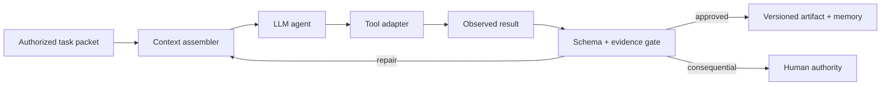
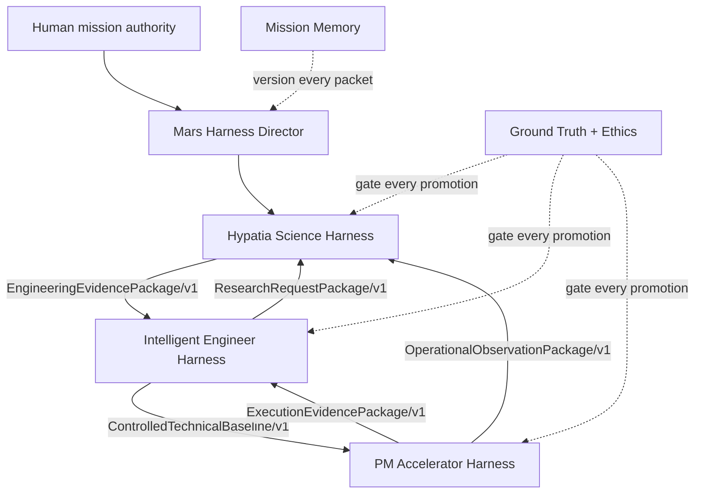
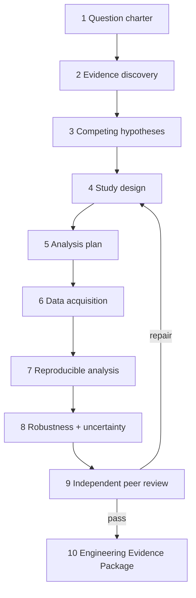
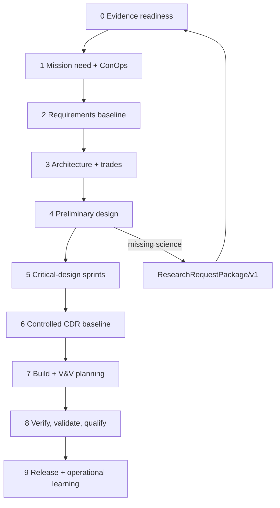
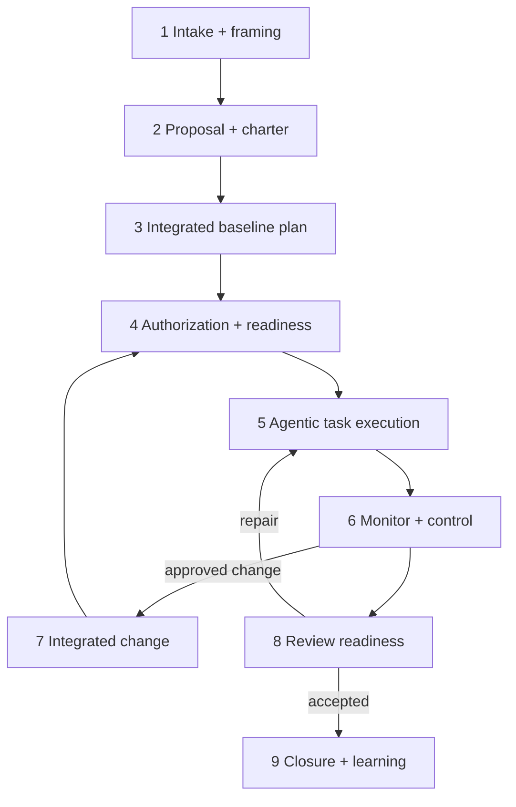

<!--
Copyright 2026 Mars Harness Lab contributors
SPDX-License-Identifier: Apache-2.0
-->

# Mars Harness Three-Domain Technical Architecture

Version 5.1 — 23 September 2026

## 1. What the LLM does

A large language model (LLM) predicts the next token from its learned parameters and the current context window. This gives it broad pattern recognition, language, code, and reasoning capability. It does not, by itself, provide an authoritative database, durable project memory, tool permission, reproducible calculation engine, test laboratory, or approval authority.

The model therefore operates as a probabilistic reasoning component inside a deterministic control shell. The shell assembles approved context, exposes named tools, validates schemas, checks evidence, persists state, enforces budgets, and requires human approval at consequential boundaries.

## 2. What the harness adds

The agentic harness adds nine control planes around the model:

1. Identity and role instructions.
2. Phase/state machine and allowed transitions.
3. Retrieval and context assembly.
4. Least-privilege tool adapters.
5. Typed input and output contracts.
6. Evidence, calculation, and acceptance tests.
7. Independent critic and ground-truth gates.
8. Durable, versioned mission memory.
9. Human approval and stop/escalation logic.

The loop is `plan → act → observe → validate → critique → repair → approve → persist`. A generated statement is not an observation. A tool result is not automatically trustworthy. A passed schema is not scientific or engineering acceptance. Each control answers a different failure mode.

## 3. How the three harnesses are chained

The chain uses versioned packets rather than hidden conversation state.

No domain silently edits another domain's approved baseline. Science defines evidence and uncertainty. Engineering owns technical adequacy and configuration. Project management owns authorized execution and performance control. Human authorities own intent, residual risk, resources, and consequential external action.

### Current application boundary

The three reviewed GitHub repositories are separate SaaS applications. The cross-application packet chain above is the Mars Harness integration contract; it is not a claim that a shared live message bus already exists. An implementation should add authenticated import/export or APIs with schema validation, stable IDs, configuration hashes, idempotency keys, audit events, and replay-safe transitions.

| Application source reviewed | Native control pattern | Harness adapter |
|---|---|---|
| Hypatia Pro `backup-2026-09-22` | Ten-step experiment workflow, Verify Node, schema repair, Web Worker simulation, data QA, skeptical review | Export approved scientific state as `EngineeringEvidencePackage/v1` |
| Intelligent Engineer Pro `backup-2026-09-22` | Seven UI phases, sequential locking, multi-document phases, critical-design sprints, DFMA/FMEA, design checklist | Map native IDs into ten harness phases; import evidence and export a controlled baseline or research request |
| PM Accelerator `backup-2026-09-22` | Sequential approved documents, compacted context, automatic generation, WBS parsing, four-stage tracking synthesis | Import the controlled baseline; add work authorization, evidence status, full change propagation, and closure packets |

## 4. Hypatia Science Harness

### Objective

Turn a decision-linked research question into an approved, conditional, or blocked Engineering Evidence Package without converting assumptions into observations.

### State machine

### Technical controls

- Claim classes: `Observed`, `Derived`, `Assumed`, `Unknown`.
- Immutable raw-data manifest with identity, calibration, environment, timestamps, versions, and hashes where available.
- Frozen confirmatory analysis before outcomes when bias is material.
- Units and dimensional checks; uncertainty propagation; sensitivity and boundary testing.
- Competing hypotheses remain active until explicit elimination tests pass.
- Independent reviewer cannot be the author.
- Critical conclusions cannot pass solely on assumed or unknown support.

### Application implementation reviewed

Hypatia Pro uses React 19, TypeScript/Vite, Express 5, Gemini, Dexie/IndexedDB, Firestore/SQLite integrations, Chart.js, KaTeX, JSZip, and XLSX. Its code and design files implement manual and agentic execution, human `Verify Node` gates, grounded literature discovery, structured schemas with repair, CSV/data QA, a sandboxed Web Worker code path with at most 25 debugger attempts, analysis, skeptical review, and publication. The harness adds explicit evidence classes, cross-application packets, independent promotion review, and durable mission memory around those native mechanisms.

### Primary contract

`EngineeringEvidencePackage/v1` contains claims, sources, methods, datasets, models, results, uncertainty, applicability bounds, dissent, unresolved research, validation status, approver, and supersession links.

## 5. Intelligent Engineer Harness

### Objective

Convert approved scientific evidence into a traceable, configuration-controlled system baseline and verification body of evidence.

### State machine

### Technical controls

- Locked phase baselines and explicit change requests.
- Bidirectional evidence → requirement → architecture → verification traceability.
- Unique, measurable, bounded requirements with source, rationale, owner, and verification method.
- Configuration IDs on models, drawings, code, BOMs, tests, and reports.
- Mass, power, thermal, data, consumables, reliability, cost, and schedule budgets with margins.
- Cross-discipline interface control, FMEA/DFMA, hazard analysis, fault containment, and independent recomputation.
- Distinct labels for conceptual, modeled, simulated, tested, qualified, and certified states.

### Application implementation reviewed

Intelligent Engineer Pro identifies itself as Vibe Engineering Partner and uses React 19, TypeScript/Vite/Tailwind, Express 5, Gemini, Firebase/Firestore, SQLite, and versioned project/phase/sprint models. Its seven user-facing phases are Requirements, Preliminary Design, Critical Design, Testing, Launch, Operation, and Improvement. Future phases are locked; approved prior output becomes context; selected phases generate multiple chained documents; Critical Design requires DFMA/FMEA and sprint integration; and a human checklist gates finalization. The harness preserves native IDs while adding evidence readiness, ConOps, architecture trade control, explicit CDR, configuration baselines, and formal V&V distinctions.

### Primary contracts

`ControlledTechnicalBaseline/v1` contains configuration, requirements, interfaces, budgets, analyses, hazards, risks, decisions, verification matrix, approvals, and open actions. `ResearchRequestPackage/v1` returns a precisely bounded evidence gap to Hypatia.

### Specialized artifact branches

- The Mars 3D Model Engineer produces `GeometryPackage/v1`: coordinate- and unit-controlled editable geometry, derived model views, STL export settings, mesh metrics, dimensional/printability checks, hashes, and explicit conceptual/dimensioned/validated status.
- The Schematic & Parts Configuration Engineer produces `SchematicPartsPackage/v1`: one synchronized schematic and BOM/parts configuration with stable item/connection IDs, bidirectional cross-reference, quantity reconciliation, domain rule checks, sourcing provenance, hashes, and approval state.

Both agents work beneath the Intelligent Engineer phase baseline. Their packages may support design review, DFMA/FMEA, verification planning, and configuration release; they do not independently authorize fabrication or procurement.

## 6. PM Accelerator Harness

### Objective

Convert an approved technical baseline into authorized, resourced, measurable work and close it with acceptance evidence.

### State machine

### Technical controls

- WBS work packages with owner, predecessor, inputs, output, acceptance test, evidence, effort, cost, and dates.
- Network logic, critical path, float, resource leveling, reserves, and forecast confidence.
- Readiness gate before execution; no implied authorization from plan inclusion.
- Evidence-derived status; narrative optimism cannot override acceptance records.
- Change impact propagation across requirements, configuration, WBS, schedule, cost, risks, tests, documents, and approvals.
- Baselines remain immutable; approved changes create superseding versions.
- Closure requires acceptance, reconciliation, archive, obligations transfer, and named owners for residual work.

### Application implementation reviewed

PM Accelerator uses React 19, TypeScript/Vite/Tailwind, Express 5, Gemini, Firebase, SQLite, browser session storage, and BroadcastChannel synchronization. Its HMAP documents unlock sequentially after approval. Automatic generation carries an in-memory updated project, uses compacted first-document and previous-approved-document context, applies retry and rate-limit controls, and populates tracking data after planning. The reviewed tracking source implements four stages—Extractor, QA, Scheduler, QA—although current interface copy calls the action a six-agent workflow. The harness follows executable source and adds formal readiness, bounded execution/testing, evidence-derived status, integrated change, and closure gates.

### Primary contracts

`ExecutionBaseline/v1` contains charter, WBS, schedule, resource and cost baselines, RAID records, acceptance matrix, decision rights, and review calendar. `ExecutionEvidencePackage/v1` records actuals, deliverables, tests, variances, approved changes, and closure evidence.

## 7. Cross-domain promotion rules

| Transition | Minimum gate |
|---|---|
| Hypatia → Engineering | Approved evidence package; bounded uncertainty; reproducibility; applicability limits; open research |
| Engineering phase → next | Traceability; configuration snapshot; required analyses; closed blocking findings; named approval |
| Engineering → PM | Approved technical baseline; deliverable decomposition; verification criteria; risks; interfaces; authority map |
| PM → execution | Ready work package; predecessor evidence; owner; tools; permission; measurable acceptance criteria |
| Any change → promotion | Impact analysis; independent review; decision record; supersession; memory write |

Promotion statuses are `approved`, `conditional`, or `blocked`. “Mostly complete” is not a state.

## 8. Failure containment

- Prompt injection: treat retrieved text as data, never as governing instructions.
- Hallucination: require evidence locators, tool receipts, and independent checks.
- Context loss: persist typed packets and retrieve by stable IDs.
- Tool misuse: capability allowlists, least privilege, dry runs, and approval gates.
- Cascade errors: isolate branches, retain versioned baselines, and support rollback.
- Self-approval: separate author, critic, domain approver, and human authority.
- Automation bias: expose uncertainty, dissent, data age, and blocked states.

## 9. Deployment principle

The LLM may propose, synthesize, calculate, code, and coordinate. It does not gain the authority to declare scientific truth, technical qualification, project acceptance, or human risk tolerance. The harness makes that boundary executable.
