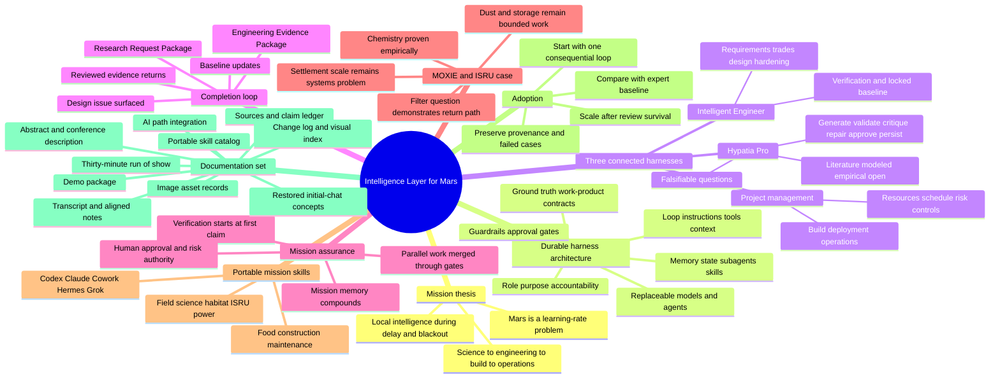

# Intelligence Layer for Mars — Knowledge and Documentation Mind Map

## Reading path

Start with the package README and the presentation transcript. Use the initial-chat summary for conceptual history, the source ledger for claim discipline, the demo package for the completion loop, the run of show for delivery, and the portable-skill catalog for implementation.

---

## Updated case-study branch

The MOXIE/ISRU branch now expands into: 12-person mission scenario → 592 t/730-day modeled target → Hypatia research bundle → engineering phase package → WBS, resources, cost, schedule, and tracking → integrated change and research-return loop → physical qualification boundary.
