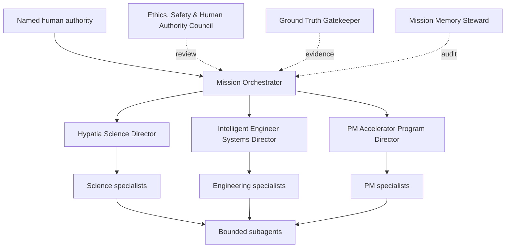

<!--
Copyright 2026 Mars Harness Lab contributors
SPDX-License-Identifier: Apache-2.0
Complete license text: https://mars-harness-lab-v5.tallman-equi-9130.chatgpt.site/license/
-->
# Ethical Specialist Agent Architecture

The Mars Harness Lab uses a recursive but bounded organization. The Mission Orchestrator appoints one accountable domain director while independent ethics, evidence, and memory controls span every branch.

## Specialist teams

| Domain | Standing specialists | Core artifacts |
|---|---|---|
| Science | Evidence & Literature; Hypothesis & Causal Inference; Experiment & Simulation Design; Data Quality & Statistics; Peer Review & Reproducibility; Reports & Visuals | Evidence ledger, causal graph, protocol, analysis, uncertainty visuals, Engineering Evidence Package |
| Engineering | Eleven lifecycle specialists plus a 34-role discipline bench covering systems, aerospace, propulsion, mechanical, structural, civil, electrical, electronics, embedded, communications, software/AI, controls/robotics, thermal, chemical/process, materials, biomedical, life support, nuclear/radiation, optics/sensors, manufacturing, quality/metrology, reliability/logistics, safety/cybersecurity, human factors, agriculture/food, mining/resources, drilling/subsurface, geospatial/survey, habitat/buildings, fire protection, acoustics/vibration, hydraulics/fluids, mechatronics/automation, and test/instrumentation | Requirements baseline, architecture, trade study, discipline analyses, models, drawings, interface definitions, FMEA, V&V matrix, technical baseline |
| PM | Charter/Stakeholder/Governance; WBS/Schedule/Critical Path; Cost/Resource/Procurement; Risk/Issue/Change; Execution; QA/Testing; Status/Dashboard/Communications; Closure/Lessons | Charter, RACI, WBS, schedule, cost baseline, RAID/change log, test record, dashboard, closure report |

## Spawn contract

Every child assignment states parent and owner; objective and decision link; scope and exclusions; authoritative inputs; tools and permissions; evidence standard; reports and visuals; acceptance tests; ethics and safety risks; time, token, and cost limits; maximum depth; reviewer; return condition; and memory destination.

Children inherit every constraint. They cannot expand permissions, alter evidence thresholds, waive ethical review, approve their own high-risk output, or hide a blocked result. Default maximum depth is three. The parent validates and integrates all child work and remains accountable.

## Ethics gate

The independent Council returns `pass`, `conditional`, or `block`. It evaluates human authority, safety, scientific integrity, privacy and security, fairness and accessibility, environmental effects, reversibility, transparency, conflicts, and affected parties. High-risk residual risk requires named human acceptance; prohibited or unauthorized actions remain blocked.

## Recursive mission loop

Science specialists establish evidence and uncertainty. Engineering specialists turn approved evidence into requirements, architecture, analyses, and verification. Engineering blockers return as typed research requests. PM specialists turn approved baselines into owned, scheduled, resourced work and return execution evidence. Every transition passes ground-truth and ethics gates and writes to mission memory.
